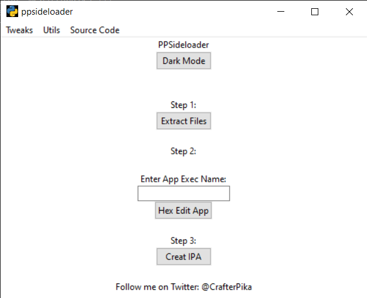

# ++sideloader_py
an python implementation of @eni9889's ppsideloader 
injecting/patching tweaks into apps by loading a library on the main app executable

# Requirements

- [Python v3.8.3](https://www.python.org/downloads/release/python-383/) (only if you want to run it from the source code)
- [Theos-Jailed compiled .dylibs](https://github.com/kabiroberai/theos-jailed/wiki/Installation)

# out-of-the-box apps
it supports to build apps out of the box:
- AppCake++
- Spotify++
- ZipAppLite++

# How to use (Custom App)

1. MacOS or Windows user download the pre-compiled binrary from [here](https://github.com/CrafterPika/ppsideloader_py/releases)
2. Get an (decrypted) ipa from your app
3. Extract the .ipa and compress the content of <code>Payload/AppName.app/</code> (the content of <code>AppName.app</code> not the .app folder itself) to <code>app.zip</code>
4. Get your Tweak <code>.dylib</code> <b>(needs to be compiled with theos-jailed)</b> and compress to <code>Tweak.zip</code>
5. Extract the ppsideloader_py <code>.zip</code>
6. Copy both zips into the directory where the program is
7. Open the ppsiderloader_py prgram  with
8. Click on <code>Extract Files</code>, it will setup everything
9. Enter the App Exec name in the box and click on <code>Hex edit app</code> 
10. Click on <code>Creat IPA</code> and your ipa with the ++ tweak will be made.

# To-do
* `+` Linux port (Why? for some reason i cannot use the tkinter library so..)
* `?` iOS Port (maybe)
* `✓` Feature: Restore main app exec backup
* `✗` Feature (MacOS Only): Sign apps on enterprise certs (maybe)

# Screenshot

# Credits
- <a href="https://github.com/eni9889">@eni9889</a> for <a href="https://github.com/eni9889/ppsideloader">The Original ppsideloader</a>
- <a href="https://github.com/julioverne/">@julioverne</a> for <a href="https://github.com/julioverne/libloader-sideloader">libloader</a>
- <a href="https://github.com/saurik/">@saurik</a> for CydiaSubstrate.framework
